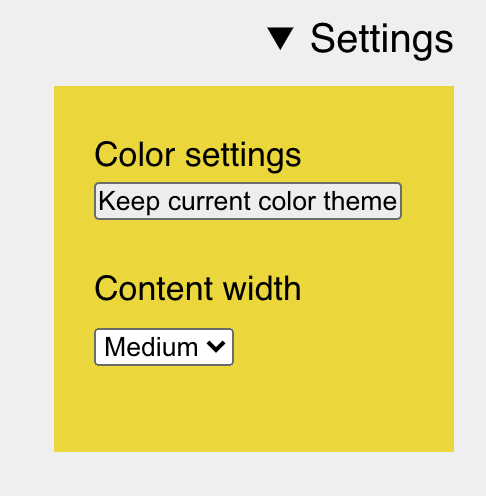



Over the weekend I implemented a new settings section for my website (the one you read right now!). You can now choose the width of content for articles and pages to better suite your reading preference. I like smaller content because it makes it easier for me to read, others like full-width content.



<figure>

<figcaption>The new settings UI</figcaption>
</figure>



Click the "Settings" link in the top right and you'll be able to configure the randomness of the color schema and the width of content. These settings are persistent and stored in [LocalStorage](https://developer.mozilla.org/de/docs/Web/API/Window/localStorage) directly in the browser.

For the future I want to have an option to increase font sizes and choose color schemes (or individual colors), but the next big thing I want to get done first is a Dark Mode.