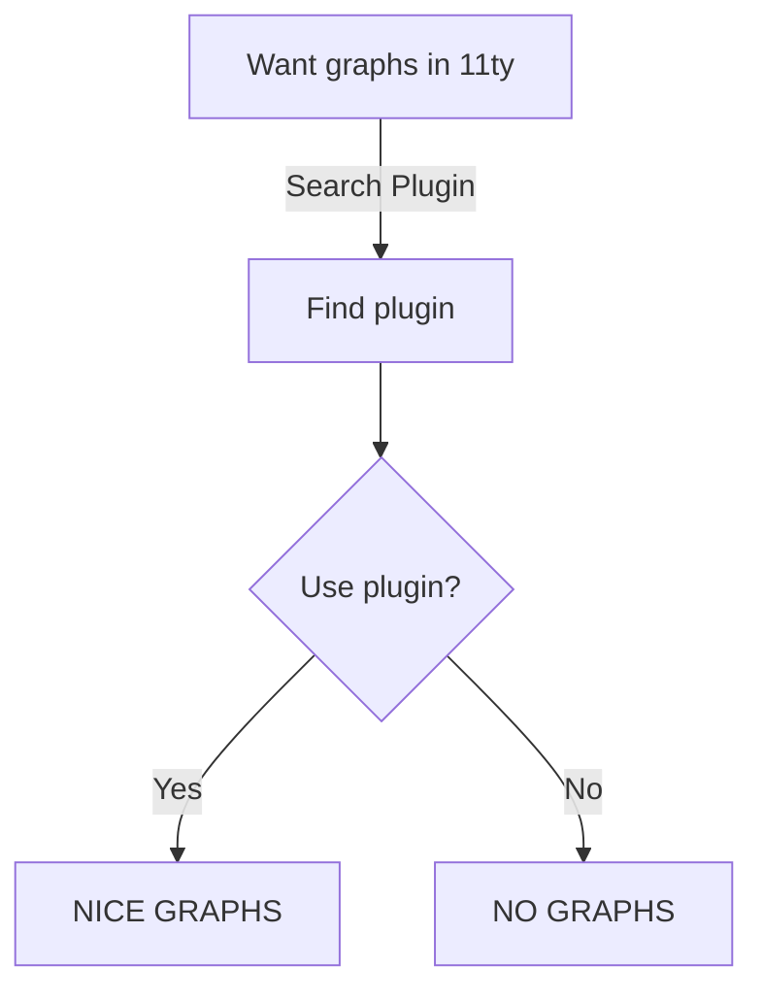
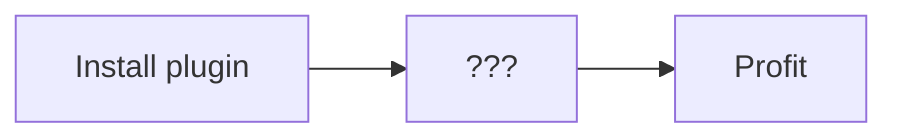
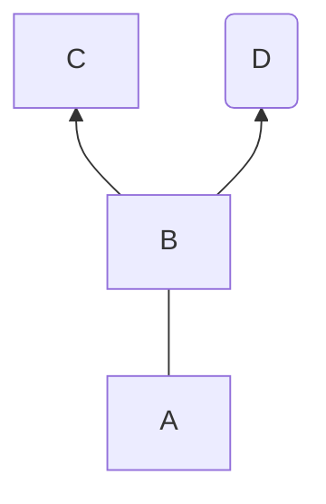
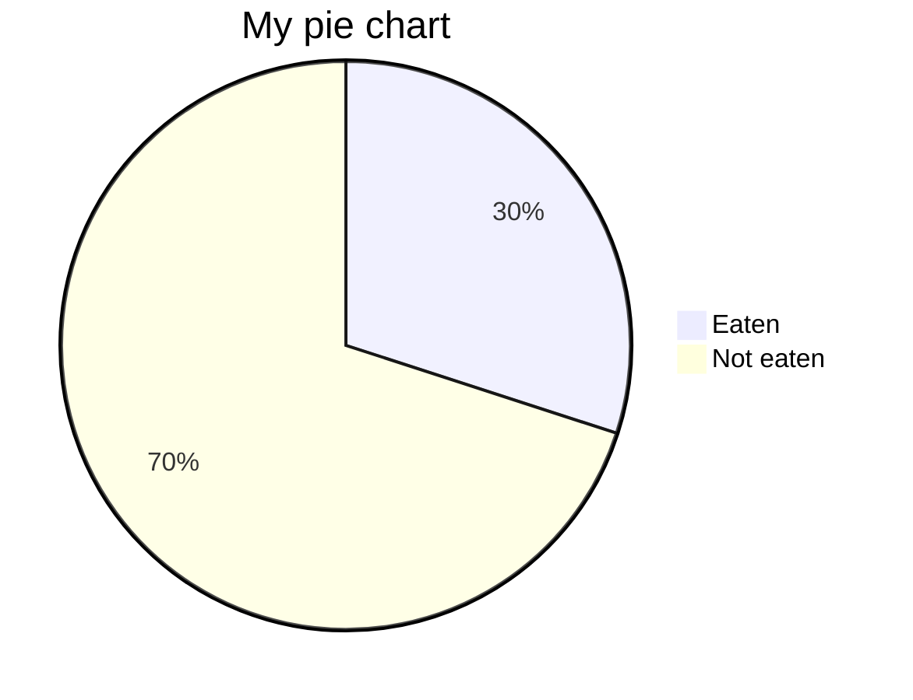
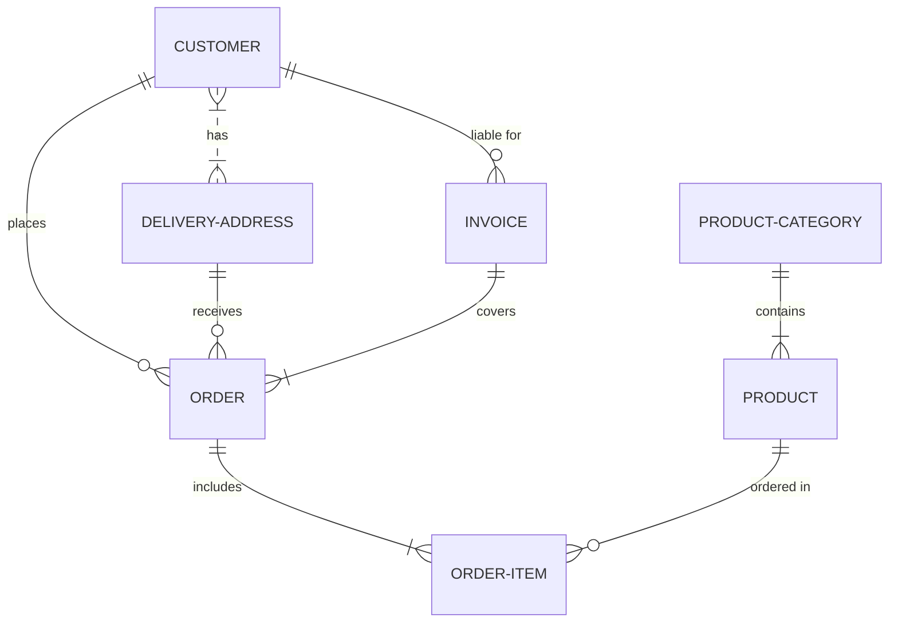

This plugin integrate the [Mermaid graphic library](https://mermaid-js.github.io/mermaid/#/) with [Eleventy](https://11ty.dev/), all that is needed is a Code Block with the `mermaid` language tag.

See [GitHub Readme](https://github.com/KevinGimbel/eleventy-plugin-mermaid) for setup instructions.

## Examples

The following graphs are all rendered with the plugin, see [source code of this page on GitHub](https://github.com/KevinGimbel/kevingimbel.de/tree/main/src/_projects/2021/eleventy-plugin-mermaid.md).

